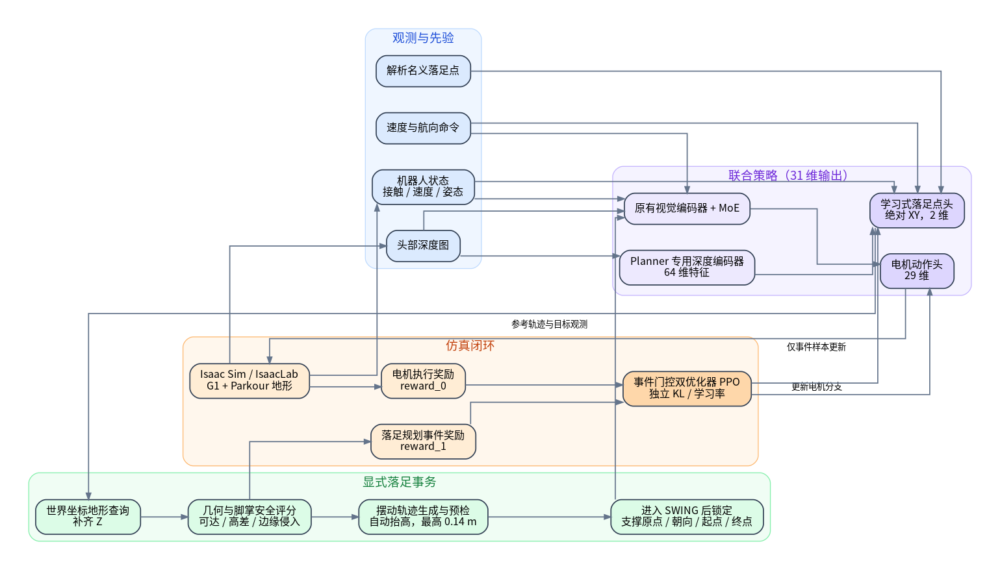
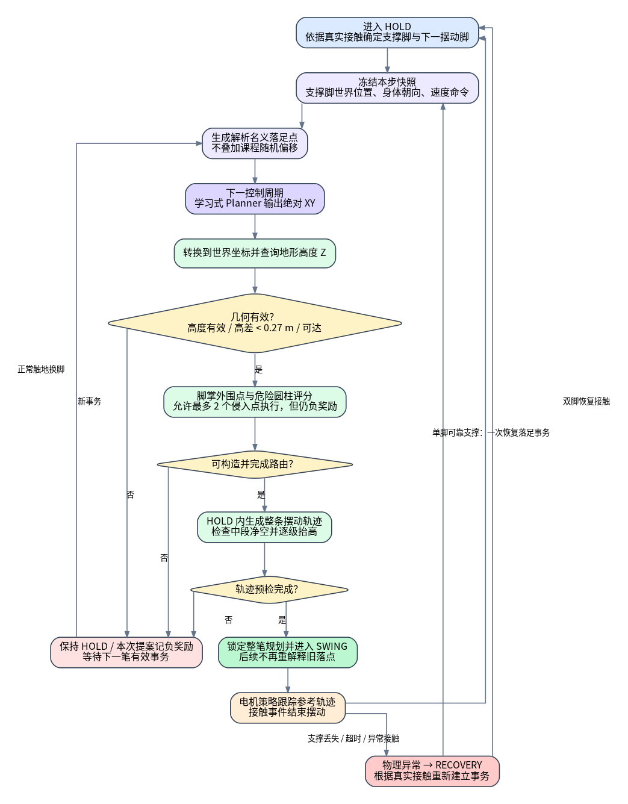
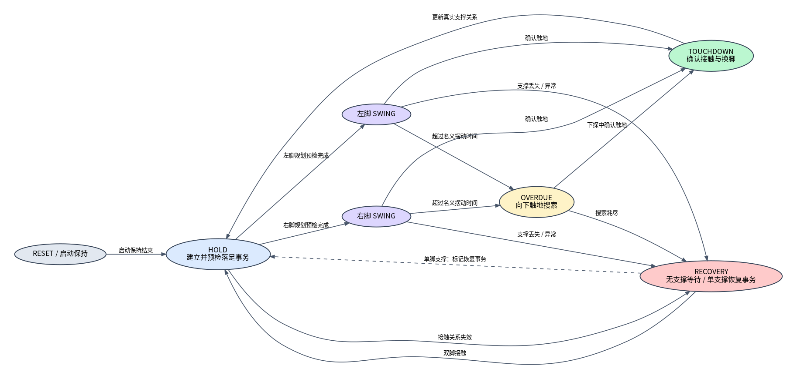

# InstinctLab 显式落足点规划项目交接手册（个人完整版）

> 版本日期：2026-08-28
> 项目目录：`/home/zhangweibo/InstinctLab-foothold`
> Git 分支：`feat/foothold-01-flat-tracking`
> 文档基线提交：`aab3f77 Refine learned foothold planning and recovery`
> 远程仓库：<https://github.com/wbZ-123/InstinctLab/tree/feat/foothold-01-flat-tracking>

## 0. 先读这一页

这个项目不是把原版 Hiking 的动作策略推倒重写，而是在它已有的 **AMP + MoE 低层电机策略、深度视觉和 Parkour 地形训练框架** 上，增加了一套可观察、可约束、可学习的显式落足点规划闭环。

核心链路是：

```text
解析名义落足点
→ 学习式 Planner 结合深度图与机器人状态输出绝对 XY
→ 在世界坐标查询地形高度 Z
→ 做几何、脚掌外围和摆动轨迹安全评估
→ 锁定一笔摆动事务
→ 将最终落点与参考轨迹作为观测交给原有 29 维电机策略跟踪
→ 使用独立的落足事件奖励和 PPO 分支更新 Planner
```

当前状态必须如实表述：

- ✅ 显式规划、学习式 Planner、专用深度编码器、事件门控 PPO、坐标冻结、安全评分、轨迹预检、可视化、日志和测试体系均已接入。
- ✅ 2026-08-28 当前完整测试为 `440 passed`；`no_fly=-3.0` 是交接时确认的训练配置，并由回归测试锁定。
- 🟡 平地规划和大部分软件链路可以工作，但上下楼梯的稳定选点、低层轨迹跟踪、提前触地及 Recovery 行为仍需继续训练与验证。
- 🟡 当前最新实验 `20260827_143859_learned_planner_ellipse1m_apex14cm_30000it` 只运行到约第 1183 轮，不是完成的 30000 轮结果。
- 🔴 尚未完成真实机器人部署；仿真中的危险圆柱属于特权安全信息，实机感知闭环仍需单独设计和验证。

一句话总结：**工程骨架和闭环已经搭好，但最终算法性能尚未收敛，不应将本版本描述为“复杂地形稳定可靠落足已经完成”。**

---

## 1. 项目目标与技术边界

### 1.1 要解决的问题

原版 Hiking 能够依靠深度视觉和低层策略在复杂地形运动，但“下一脚具体踩在哪里”主要隐含在策略内部。这样做的优点是端到端、结构简洁；缺点是落足点难以直接解释、约束、调试和迁移。

本项目希望把落足点变成明确的中间变量，使系统能够：

1. 每一步都给出明确的三维目标落足点；
2. 显式检查可达性、地形高度和脚掌边缘安全；
3. 生成并显示完整摆动参考轨迹；
4. 让学习式 Planner 根据头部深度图和状态学会调整名义落足点；
5. 将最终落点和轨迹闭环输入低层电机策略；
6. 分开观察 `reward_0`（动作执行）与 `reward_1`（落足规划）；
7. 在异常时明确区分正常规划、触地超时和 Recovery。

### 1.2 当前没有解决的边界

- 没有完成 sim-to-real；
- 没有证明 Planner 已在所有楼梯宽度和高度上收敛；
- 没有用实机深度图替代全部仿真特权安全判断；
- 没有完成不同机器人模型的重新标定；
- 没有把所有参数从“工程试验值”升级为严格标定值；
- 没有完成“单支撑 Recovery 时用左右脚高度扫描中位数确定悬空脚目标高度”的需求。

---

## 2. 相对于原版 Hiking 的区别

| 维度 | 原版 Hiking / InstinctLab | 本项目新增或修改 |
|---|---|---|
| 落足表达 | 落足行为主要隐含在动作策略中 | 显式维护名义落点、学习落点、最终执行落点和完整摆动轨迹 |
| 策略输出 | 29 维电机动作 | 29 维电机动作 + 2 维 Planner 绝对 XY，共 31 维 |
| 高层规划 | 无独立学习式落足头 | 小型落足 MLP `[128, 64]`，与电机 MoE 参数隔离 |
| 深度视觉 | 原有深度编码器主要服务电机策略 | 同一张头部深度图增加 Planner 专用轻量编码器，输出 64 维特征 |
| 高度生成 | 不显式暴露下一脚世界高度 | Planner 只输出 XY；转换到世界坐标后查询地形获得 Z |
| 安全约束 | 通过地形、碰撞和总体奖励隐式学习 | 显式检查可达椭圆、两脚高差、脚掌外围点、危险圆柱和轨迹净空 |
| 摆动过程 | 由原策略隐式完成 | 显式生成参考轨迹，并在 HOLD 内完成轨迹预检和自动抬高 |
| 时序 | 原任务时序 | 新增 HOLD / 左右 SWING / TOUCHDOWN / OVERDUE / RECOVERY 状态事务 |
| PPO | 原 `WasabiPPO` | `EventGatedWasabiPPO`：电机分支沿用原更新，Planner 使用独立优化器、KL 和事件样本 |
| 奖励 | 单组 locomotion / AMP 奖励 | 两个奖励头：`reward_0` 执行动作，`reward_1` 规划落点 |
| 调试 | 通用 Play / TensorBoard | 台阶专用 Play、双环境上下楼、目标/轨迹 Marker、逐级路由与 Recovery 诊断 |
| 测试 | 原项目测试 | 增加 `tests/parkour/foothold/` 的纯逻辑、集成、日志和配置测试 |

必须注意：本仓库 **没有复制或修改外部 Instinct-RL 包本体**。对网络和 PPO 的扩展都放在本项目的 `source/instinctlab/instinctlab/learning/` 下，通过配置动态注册和调用外部包接口。因此，新电脑除了克隆本仓库，还必须安装匹配版本的 IsaacLab、Isaac Sim 和 Instinct-RL。

---

## 3. 总体架构



### 3.1 两层策略如何闭环

学习式 Planner 和电机策略不是两个完全分离的进程，而是同一个 Actor-Critic 中参数隔离的两个分支：

- 电机分支：原有 MoE，输出 29 维关节动作；
- Planner 分支：专用深度编码器 + 小型 MLP，输出支撑脚冻结坐标系下的绝对 XY；
- Planner 的最终三维落点和摆动参考轨迹会进入电机策略观测；
- 电机策略据此产生关节动作，因此 Planner 的结果确实闭环影响机器人动作；
- `reward_0` 主要更新电机分支，`reward_1` 只在落足事件发生时更新 Planner 分支。

这里的“绝对 XY”是指 **相对于本步冻结支撑脚坐标系的目标位置**，不是世界坐标绝对值，也不是对名义落点的增量。目标 Z 不由网络预测。

### 3.2 坐标系约定

这是整个项目最容易出错的地方，接手后修改前必须先画清楚坐标关系。

1. 解析名义点和学习式 XY 都在本步冻结的支撑脚规划坐标系中；
2. 进入 HOLD 建立事务时，冻结支撑脚世界位置和身体朝向；
3. 使用冻结变换把 XY 投到世界坐标；
4. 用世界 XY 查询地形，得到世界 Z；
5. 摆动轨迹在世界坐标中生成；
6. 参考误差和目标误差返回策略前，再旋转回冻结 Planner 坐标系；
7. 一旦进入 SWING，禁止使用实时移动后的支撑脚重新解释旧目标。

对应实现集中在 `frame_transform.py`、`foothold_planner.py` 和 `observations/foothold.py`。

---

## 4. 一步落足事务的完整流程



### 4.1 正常双脚接触后的流程

1. 状态机进入 HOLD，根据真实接触关系确定支撑脚和下一只摆动脚；
2. 冻结支撑脚世界位置、身体朝向和当前速度命令；
3. 解析 Provider 根据速度、预瞄时间和名义步宽生成名义落足点；
4. 学习式 Planner 在下一控制周期读取名义点、机器人状态与专用深度特征，输出 2 维绝对 XY；
5. 把学习 XY 变换到世界坐标，并在地形网格查询目标 Z；
6. 检查数值有限、地形高度有效、支撑脚到目标脚高度差、可达椭圆；
7. 生成脚掌最底层外围采样点，检查其对危险圆柱的侵入数量、总侵入深度和最小净空；
8. 在 HOLD 内生成完整摆动轨迹，并检查起点、终点和中段净空；
9. 如果中段不安全，逐级增加摆动最高点，当前上限为 `0.14 m`；
10. 预检完成后锁定整笔事务，状态机才允许进入 SWING；
11. 电机策略跟踪轨迹，触地事件确认后更新真实支撑关系并进入下一笔事务。

### 4.2 安全不是单一布尔值

当前 Planner 奖励同时使用连续评分和执行门槛：

- 几何无效：高度查询失败、非有限、超出可达范围或高差超限，直接不可执行；
- 危险圆柱侵入：用于连续负奖励；
- 当前端点执行允许最多两个外围采样点侵入，但这些侵入仍给负奖励；
- 三个及以上侵入点属于执行不安全；
- 轨迹中段净空会驱动自动抬高，不能解决时本次预检失败。

允许少量侵入是当前仿真训练策略，不代表实机安全标准。部署前应重新评估是否恢复到零侵入硬约束。

### 4.3 摆动轨迹

轨迹由起点、终点和最高点构造：

- XY 平滑连接摆动脚真实起点与最终落点；
- Z 先上升到最高点，再下降到地形目标高度；
- 默认最高点 `0.08 m`；
- 碰到轨迹危险区时以 `0.03 m` 为步长提高，最高到 `0.14 m`；
- 名义摆动时间当前为 `0.32 s`；
- 超时后进入 OVERDUE，并只沿世界 Z 向下搜索触地，不重新规划 XY。

---

## 5. 状态机与 Recovery



### 5.1 状态含义

- `HOLD`：建立或等待本步落足事务；
- `LEFT_SWING` / `RIGHT_SWING`：执行已锁定的左/右摆动轨迹；
- `TOUCHDOWN_CONFIRM`：确认触地并更新支撑脚；
- `OVERDUE`：名义摆动结束仍未可靠触地，向下搜索；
- `RECOVERY`：支撑关系或物理状态异常，暂停普通交替步态；
- `PLAN_INVALID` 在当前思路中应作为规划结果诊断，不应形成“规划失败—Recovery—再次规划失败”的死循环。

### 5.2 当前 Recovery 逻辑

接触自适应 Recovery 已在学习式 Planner 配置中启用：

```text
无可靠支撑：保持 RECOVERY，不产生恢复落点
双脚可靠接触：返回普通 HOLD
恰好一只脚可靠支撑：
    固定该脚为支撑脚
    另一只脚成为恢复摆动脚
    以其当前真实世界位置作为轨迹起点
    创建一次单支撑恢复落足事务
```

Recovery 事务与正常事务的主要区别：

- 它从任意真实悬空脚位置开始，不能假设摆动脚已在地面；
- 同一接触关系只允许一次提案，避免每个控制周期反复采样；
- 几何有效仍是硬门槛；
- 当前仿真设计允许危险圆柱安全分为负的恢复落点执行，以给 Planner 学习信号；
- 支撑脚一旦丢失，立即废弃当前事务并回到 Recovery。

这部分仍是高风险、未充分验证的逻辑。尤其要继续检查：

- 单支撑恢复是否真的能稳定退出；
- 不安全恢复点执行是否导致新的摔倒循环；
- Recovery 与普通规划事件是否在 PPO 统计中正确分开；
- Recovery 阶段被屏蔽的奖励是否符合预期。

### 5.3 尚未实现的 Recovery 需求

此前提出过：单脚支撑退出 Recovery 时，用 `left_height_scanner` / `right_height_scanner` 的中位数估计另一只脚高度，并在摆动脚高于目标地形时由地形决定轨迹最高点。该需求 **目前未落地**，不要误认为已实现。

---

## 6. 学习式 Planner 网络与 PPO

### 6.1 输入

Planner 能读取联合策略的编码后状态，其中包括：

- 机器人本体状态、速度和命令；
- 当前名义落足点；
- 显式 Planner 状态观测，例如最终目标、可行速度、相位、摆动腿、轨迹最高点、净空、参考误差、目标误差、接触与离地标志；
- 与电机策略相同的头部深度图，但通过 Planner 专用轻量编码器形成额外 64 维特征。

专用深度编码器使用深度可分离卷积、1×1 通道混合、自适应池化和线性投影。它没有使用脚底高度扫描或地形标签，因此原则上保留了实机感知接口的一致性；但头部相机可能看不到脚边局部区域，这是实机泛化必须继续处理的问题。

### 6.2 输出

- 输出 2 维归一化动作；
- 解码为冻结支撑脚坐标系中的绝对 XY；
- 当前可达椭圆最大半轴为前后 `1.00 m`、左右 `0.25 m`；
- Z 由世界地形查询补齐；
- 这两个半轴是当前试验参数，`1.00 m` 尤其不是 G1 的严谨运动学标定结论。

### 6.3 与 MoE 的关系

MoE 仍只负责低层 29 维电机动作。专家并不是人工指定的“平地专家、楼梯专家”，而是在训练中由门控和梯度自行分化。Planner 是另一套小网络，不与电机 MoE 共享 Planner 专用参数。

### 6.4 为什么使用事件门控 PPO

Planner 只在新的落足事务中产生一次有效决策。如果把每个仿真控制步都当作 Planner 样本，同一个动作会被重复记很多次，奖励语义和梯度都会失真。

当前扩展提供：

- Planner 事件掩码；
- 独立 rollout 字段；
- Planner 独立优化器；
- Planner 独立学习率与 KL；
- Planner 独立标准差范围；
- 电机策略继续使用原有 minibatch 更新逻辑。

关键配置：

| 参数 | 当前值 |
|---|---:|
| 电机动作维度 | 29 |
| Planner 动作维度 | 2 |
| Planner MLP | `[128, 64]` |
| Planner 深度特征 | 64 |
| 深度隐藏通道 | 8 |
| Planner 初始学习率 | `1e-5` |
| Planner 探索标准差 | 初始/最大 `0.05 m`，最小 `0.02 m` |
| Planner KL 目标 | 跟随原 PPO `desired_kl` |
| Planner KL 停止倍数 | `2.0` |

### 6.5 `reward_0` 与 `reward_1`

- `reward_0`：电机执行层总奖励，包含速度、姿态、AMP、动作正则、显式摆动跟踪、提前触地、Recovery 等；
- `reward_1`：只在 Planner 落足事件时非零，用来训练落足点输出；
- 两者数值尺度、采样频率和含义不同，不能直接比较谁“更大”；
- `reward_1` 曲线下降不一定代表电机策略变差，可能是 Planner 开始遇到更难的非安全名义点、更多恢复事件或执行预检失败。

---

## 7. Planner 落点奖励的当前表达

当前 `reward_1` 将以下量压缩到 `[-1, 1]`：

1. **安全余量**：脚掌外围离危险圆柱越远越好；侵入时根据侵入情况给负值；
2. **有符号命令方向分**：沿冻结命令方向前进为正，原地附近为零，反向为负；
3. **合理步长分**：最理想是达到命令预测步长，不是越远越好；
4. **名义点接近分**：完全一致为 `+1`，偏离 2 cm 时到 `0`，继续偏离逐渐为负；
5. **几何和完整轨迹结果**：几何无效或已知预检不安全时直接为 `-1`。

权重按名义点是否安全分支：

| 场景 | 安全余量 | 命令方向 | 合理步长 | 名义点项 |
|---|---:|---:|---:|---:|
| 名义点安全 | 0.40 | 0.25 | 0.20 | 0.15 |
| 名义点不安全 | 0.45 | 0.30 | 0.20 | 0.05 |
| 学习点有侵入 | 0.70 | 0.15 | 0.10 | 0.05 |

有任意侵入时，最终分数最多为 `-0.05`，防止“少量侵入仍获得很高正奖励”的旧漏洞。几何无效或完整执行预检失败为 `-1`。

这个奖励解决了两个典型投机行为：

- 只追求安全、向后退到台阶前原地踏步；
- 只追求前进、把落点推到可达椭圆最前端。

但它还不能保证网络已经学会“离名义点最近的安全踏面”。后续应重点检查非安全名义点事件是否足够、是否被安全样本淹没，以及 Planner 是否真正看到与落足位置对齐的地形信息。

---

## 8. 电机层摆动与落地奖励

当前显式跟踪相关主要项如下，权重来自当前 `parkour_env_cfg.py`：

| 奖励/惩罚 | 当前权重 | 作用 |
|---|---:|---|
| 摆动位置指数跟踪 | `+0.8` | 跟踪三维参考位置，带宽 5 cm |
| 摆动速度指数跟踪 | `+0.2` | 跟踪参考足端速度，带宽 5 cm 等效尺度 |
| 落地指数跟踪 | `+0.2` | 后半段靠近最终落点，带宽 10 cm |
| 轨迹侵入深度 | `-4.0` | 惩罚摆动轨迹进入危险区域 |
| 摆动期接触 | `-1.2` | 抑制提前触地 |
| 未真正离地 | `-1.8` | 防止名义摆动但脚未抬起 |
| 摆动高度不足 | `-3.0` | 只惩罚低于参考高度 |
| 摆动 XY 误差 | `-1.5` | 后半段最大放大到 2 倍 |
| Touchdown XY 有界分 | `+1.0` | 2 cm 内满分，5 cm 为零，10 cm 附近到 -1 |
| Touchdown Z 误差 | `-1.0` | 惩罚落地高度误差 |
| Recovery 指示 | `-1.0` | 促使策略尽快离开恢复状态 |
| no-fly | **`-3.0`** | 当前源码对双脚离地的惩罚 |

`no_fly=-3.0` 是交接时最终确认值。此前回归测试仍要求 `-1.0`，交接提交前已将测试同步为 `-3.0`。后续如需改变双脚离地惩罚，应单独做 A/B 实验并同步修改配置、测试与文档。

---

## 9. 已完成工作与证据

### 9.1 已完成的软件能力

- 显式落足点 Sensor、配置和数据容器；
- 解析名义落足点生成；
- 学习式绝对 XY 落足输出；
- 世界坐标地形高度查询；
- 支撑脚坐标快照与 SWING 锁定；
- 脚掌外围点安全评分和危险圆柱侵入统计；
- 可达椭圆和最大两脚高差检查；
- 摆动轨迹生成、全轨迹预检和自动抬高；
- Planner 专用深度编码器；
- 29+2 双分支 Actor-Critic；
- Planner 独立 PPO 优化器、KL、标准差和事件存储；
- 正常与 Recovery 单支撑落足事务；
- 电机策略闭环观测；
- 台阶专用双环境 Play、Marker 和详细调试打印；
- TensorBoard 监控与日志分析脚本；
- 参数审计、项目状态、设计说明和测试套件。

### 9.2 已知验证

- 2026-08-28 当前完整测试：`440 passed`；
- `test_parkour_config_registers_no_fly_with_minus_three_weight` 已锁定 `no_fly=-3.0`，防止再次漂移；
- 早期 4096 环境性能基线确认原版本身 collection 约 5 秒，新增 Planner 深度分支会使 learning 时间上升；
- 坐标系修复后的短训中曾观察到路由成功、几何无效和预检失败指标恢复正常；
- 多轮 Play 已能显示名义点、学习提案、执行目标和摆动轨迹，并区分上下楼机器人。

这些证明“代码链路能够运行”，不等于“最终步态性能已经达到目标”。

---

## 10. 未完成工作、当前风险与优先级

### P0：先确认当前训练基线

1. 最新 `ellipse1m_apex14cm` 训练只到约 1183/30000，不能用于最终结论；
2. `no_fly=-3.0` 是当前确认值；后续不得只改单侧配置而不更新测试与文档；
3. 前后可达半径 `1.00 m` 非严谨运动学标定，可能让网络输出过长步幅；
4. Recovery 学习式落点允许安全分为负但几何有效的点执行，需要确认是否造成新的摔倒循环；
5. 当前任务 `startup_hold_s=0.15`、`reset_hold_s=0.15`，Sensor 类默认值不同，修改时要以任务实例化结果为准。

### P1：上下楼稳定性

- 楼梯前名义点不安全时，Planner 是否学会向上一阶安全踏面移动；
- 上楼过程中 Marker 缺失究竟是未产生事务、预检失败还是 Recovery；
- 下楼是否仍有双脚跳步和提前触地；
- 学习点、最终执行点和实际落点三者误差；
- Planner 安全事件和非安全事件的样本比例是否失衡。

### P1：低层跟踪

- 摆动脚实际空中时间是否接近 0；
- 参考轨迹和实际脚位置是否仍存在 10–30 cm 级误差；
- Touchdown 2 cm 精度目标是否真正达到；
- 轨迹安全但实际脚侵入危险区时，是低层跟踪问题还是接触估计问题。

### P1：Recovery

- 进入原因分布：支撑丢失、提前接触、超时、无脚接触分别占多少；
- 单支撑恢复事务是否只生成一次；
- 双脚恢复接触后是否立即回到正常 HOLD；
- Planner 事件奖励是否在 Recovery 中被错误屏蔽；
- 完成未实现的高度扫描中位数方案前，先证明它确实必要。

### P2：实机与换模型

- 用实机可得深度图替换危险圆柱特权判断；
- 相机外参、深度噪声、延迟和遮挡随机化；
- G1 以外机器人重新标定脚底尺寸、可达范围、名义步宽、摆动时间和触地阈值；
- ONNX 导出和实机推理周期验证；
- 建立可回放的实机安全日志。

---

## 11. 主要代码文件构成

### 11.1 核心 Planner

| 文件 | 作用 |
|---|---|
| `source/instinctlab/instinctlab/sensors/foothold_planner/foothold_planner.py` | 主编排器：接触、事务、名义点、学习点、地形、轨迹、安全、路由与数据发布 |
| `.../foothold_planner_cfg.py` | Planner 时序、脚底、地形、安全和 Recovery 参数 |
| `.../foothold_planner_data.py` | 训练、奖励、监控和可视化共享的数据字段 |

### 11.2 纯逻辑模块

| 文件 | 作用 |
|---|---|
| `source/instinctlab/instinctlab_foothold/state_machine.py` | HOLD / SWING / TOUCHDOWN / OVERDUE / RECOVERY 状态转移 |
| `flat_provider.py` | 解析名义落足点、名义步宽、可达椭圆 |
| `learned_target.py` | 学习点与名义点路由及原因码 |
| `target_search.py` | 脚掌外围点、危险圆柱侵入、安全分和候选工具 |
| `trajectory.py` | 摆动轨迹与晚触地下探 |
| `clearance.py` | 完整轨迹净空检查和自动抬高 |
| `terrain_query.py` | 世界坐标地形高度查询 |
| `frame_transform.py` | 冻结支撑脚坐标与世界坐标变换 |
| `contact_adaptation.py` | 接触自适应 Recovery 判定与标定 |
| `recovery_target.py` | 解析恢复目标工具；当前学习恢复链路仍会引用部分能力 |

### 11.3 学习算法

| 文件 | 作用 |
|---|---|
| `source/instinctlab/instinctlab/learning/independent_foothold_actor_critic.py` | 29 维 MoE 电机头 + 2 维独立 Planner 头 |
| `foothold_depth_encoder.py` | Planner 专用轻量深度编码器 |
| `event_gated_foothold_ppo.py` | 事件门控 PPO、独立优化器和 KL |
| `foothold_rollout_storage.py` | Planner 稀疏事件 rollout 字段 |
| `foothold_checkpoint.py` | 旧模型向 29+2 结构迁移的 checkpoint 逻辑 |

### 11.4 环境接线与奖励

| 文件 | 作用 |
|---|---|
| `source/instinctlab/instinctlab/envs/mdp/actions/foothold_actions.py` | 接收并归一化 2 维 Planner 动作 |
| `.../observations/foothold.py` | 把落点、轨迹、误差、相位与接触状态闭环输入策略 |
| `.../rewards/foothold.py` | `reward_1` 及摆动、落地、Recovery 奖励 |
| `.../utils/wrappers/instinct_rl/vecenv_wrapper.py` | 多奖励与 Planner 事件字段传入 Instinct-RL |
| `source/instinctlab/instinctlab/tasks/parkour/config/parkour_env_cfg.py` | 任务级参数、奖励权重和功能开关 |
| `.../config/g1/agents/instinct_rl_amp_cfg.py` | Actor-Critic 和 EventGated PPO 配置 |

### 11.5 调试与测试

| 文件/目录 | 作用 |
|---|---|
| `source/instinctlab/instinctlab/monitors/foothold.py` | TensorBoard 状态、路由、误差、Recovery 指标 |
| `scripts/instinct_rl/play_debug.py` | Play 文本诊断 |
| `scripts/instinct_rl/play_foothold_viz.py` | 目标、轨迹、脚位 Marker；黄色可显示未路由提案 |
| `scripts/foothold_train.sh` | 训练入口和环境变量开关 |
| `scripts/foothold_play_step.sh` | 台阶专用上下楼 Play |
| `tests/parkour/foothold/` | 纯逻辑、配置、集成、日志分析与回归测试 |

---

## 12. 环境复现

### 12.1 依赖版本

- Ubuntu 22.04；
- Isaac Sim 5.1；
- IsaacLab 提交：`f73c331738`；
- 外部 Instinct-RL 提交：`f870ead0953fa0e3c3da3349b0aece1c74bfb421`；
- Conda 环境名通常为 `hiking`；
- AMASS / Parkour motion reference 数据集；
- 运动筛选文件 `parkour_motion_without_run.yaml`。

### 12.2 克隆代码

```bash
git clone --branch feat/foothold-01-flat-tracking \
  git@github.com:wbZ-123/InstinctLab.git InstinctLab-foothold
cd InstinctLab-foothold
git log -1 --oneline
```

### 12.3 数据路径

```bash
export PARKOUR_MOTION_REFERENCE_DIR="/home/zhangweibo/Datasets/hiking_in_the_wild/data&model/parkour_motion_reference"
export PARKOUR_MOTION_SELECTION_FILE="${PARKOUR_MOTION_REFERENCE_DIR}/parkour_motion_without_run.yaml"
```

路径中的 `&` 必须放在引号内。Hydra override 不接受随意的 `scene.xxx` 参数；优先使用上述环境变量和现有脚本。

### 12.4 运行测试

```bash
cd ~/InstinctLab-foothold
PYTHONPATH="$PWD/source/instinctlab:$PYTHONPATH" \
python -m pytest -q tests/parkour/foothold
```

### 12.5 从零训练

```bash
cd ~/InstinctLab-foothold

ENABLE_LEARNED_FOOTHOLD_PLANNER=1 \
RUN_NAME=learned_planner_ellipse1m_apex14cm_30000it \
NUM_ENVS=4096 \
MAX_ITERATIONS=30000 \
SAVE_INTERVAL=1000 \
./scripts/foothold_train.sh \
2>&1 | tee logs/learned_planner_ellipse1m_apex14cm_30000it.txt
```

### 12.6 从 checkpoint 续训

`MAX_ITERATIONS` 表示本次还要追加的迭代数，不是最终总轮数：

```bash
cd ~/InstinctLab-foothold

ENABLE_LEARNED_FOOTHOLD_PLANNER=1 \
RUN_NAME=<新实验名> \
NUM_ENVS=4096 \
MAX_ITERATIONS=<追加轮数> \
SAVE_INTERVAL=1000 \
./scripts/foothold_train.sh \
  --resume \
  --load_run <原运行目录名> \
  --checkpoint model_<轮数>.pt \
2>&1 | tee logs/<新实验名>.txt
```

### 12.7 台阶 Play

```bash
cd ~/InstinctLab-foothold

LOAD_RUN=<运行目录名> \
FOOTHOLD_DEBUG_INTERVAL=20 \
FOOTHOLD_DEBUG_ENV_IDS=all \
FOOTHOLD_CURRICULUM_SCALE_OVERRIDE=1.0 \
./scripts/foothold_play_step.sh \
  --checkpoint model_<轮数>.pt \
  --video_length 3000 \
2>&1 | tee logs/foothold_play_<轮数>.txt
```

台阶 Play 默认用两个环境分别看上楼和下楼。黄色点代表最新学习式提案，即使它未被路由执行也会显示；紫色轨迹代表当前实际锁定的摆动参考轨迹。不要把“有黄色点”误解为“这个点已执行”。

### 12.8 TensorBoard

```bash
./tensorboard.sh
```

若 6006 端口已占用，说明已有 TensorBoard 进程；结束旧进程或改端口，不是训练错误。

---

## 13. 推荐的接手顺序

### 第一天：只建立可信基线

1. 克隆指定分支并核对提交；
2. 安装匹配依赖和数据；
3. 跑全量 foothold 测试；
4. 用已知 checkpoint 跑台阶 Play；
5. 对照日志确认两个环境命令、Marker 含义和状态机；
6. 不修改算法。

### 第二阶段：定位当前性能瓶颈

按下面顺序拆问题，不要同时改奖励、状态机和网络：

```text
Planner 是否产生提案？
→ 提案是否几何有效？
→ 是否有危险圆柱侵入？
→ 是否通过完整轨迹预检？
→ 最终是否执行学习点？
→ 电机脚是否跟到轨迹？
→ 接触为何进入 Recovery？
```

重点指标：

- 学习事件数；
- 名义安全/不安全事件比例；
- 不安全名义点修正成功率；
- 学习点路由率与回退率；
- 几何无效、端点不安全、预检不安全各自比例；
- Planner KL、标准差、梯度范数；
- 摆动 XY/Z 误差与 Touchdown 误差；
- 提前接触、未离地、OVERDUE、Recovery 入口原因；
- Recovery 持续比例和每次摆动触发次数。

### 第三阶段：一次只验证一个假设

推荐优先级：

1. 以 `no_fly=-3.0` 作为当前基线，若要改权重必须做独立 A/B 实验；
2. 重新标定可达椭圆，尤其前后 `1.0 m`；
3. 统计非安全名义点事件是否足够，决定是否需要类别均衡 PPO；
4. 验证楼梯前停步是 Planner 选点问题还是轨迹预检问题；
5. 验证小跳是低层跟踪、提前触地还是 Recovery 事务问题；
6. 最后再考虑修改奖励权重或网络结构。

---

## 14. 修改代码时的硬性规则

1. 先读当前源码，不以聊天记忆或旧文档代替；
2. 先写能复现问题的失败测试，再改实现；
3. 世界高度查询必须使用世界 XY；
4. 进入 SWING 后不得改变支撑脚快照、朝向、轨迹起点、终点和最高点；
5. 几何无效与安全分低必须分开，不能让软奖励绕过不可构造目标；
6. Planner 事件一笔事务只记录一次，不要每个控制步重复评估；
7. 保持电机 PPO 原始更新逻辑，Planner 的独立更新不得反向污染电机 MoE；
8. Play 的可视化状态与实际路由状态要分开；
9. 不要为了某一张截图增加只适用于台阶的隐藏规则；
10. 修改后至少跑相关测试、全量 foothold 测试、64 环境短训和 4096 环境性能验收。

---

## 15. 给接手 AI 的完整 Prompt

下面内容可直接复制给新电脑上的 AI。把实际依赖路径和最新 checkpoint 补上即可。

```text
你现在接手一个基于 InstinctLab / Hiking in the Wild 的 G1 双足机器人显式落足点规划项目。

项目仓库：
https://github.com/wbZ-123/InstinctLab/tree/feat/foothold-01-flat-tracking

本地预期目录：
/home/zhangweibo/InstinctLab-foothold

开始工作前，必须依次阅读：
1. docs/FOOTHOLD_PROJECT_HANDOVER_PERSONAL.md
2. PROJECT_CONTEXT.md
3. docs/foothold_project_status.md
4. docs/foothold_parameter_audit.md
5. docs/superpowers/specs/2026-08-26-recovery-learned-foothold-design.md
6. source/instinctlab/instinctlab/sensors/foothold_planner/foothold_planner.py
7. source/instinctlab/instinctlab/envs/mdp/rewards/foothold.py
8. source/instinctlab/instinctlab/learning/event_gated_foothold_ppo.py

项目核心不是替换原版 29 维 MoE 电机策略，而是在其上增加显式高层落足 Planner：
- 联合动作共 31 维：前 29 维电机动作，后 2 维学习式落足 XY；
- Planner 输出冻结支撑脚坐标系中的绝对 XY，不是修正量；
- 世界坐标地形查询补齐 Z；
- 最终落点和摆动参考轨迹作为观测闭环输入电机策略；
- Planner 使用独立小网络、专用深度编码器、独立优化器、KL 和事件门控 PPO；
- reward_0 是电机执行奖励，reward_1 是稀疏 Planner 事件奖励。

当前必须遵守的坐标和事务约束：
- HOLD 建立事务时冻结支撑脚世界位置、身体朝向和命令；
- 地形高度查询必须使用世界坐标 XY；
- HOLD 中完成落点检查、轨迹生成和完整轨迹预检；
- 只有预检完成才能进入 SWING；
- SWING 中不得使用实时支撑脚重新解释旧目标；
- 接触关系变化或支撑丢失时必须废弃旧事务。

当前状态：
- 软件链路已经完成；2026-08-28 当前全量测试为 440 passed；
- 最新源码基线提交为 aab3f77；
- 当前性能仍未完成：楼梯选点、摆动跟踪、提前触地和 Recovery 需要继续验证；
- 最新 ellipse1m_apex14cm 训练只到约 1183/30000，不是完成结果；
- 未部署实机，危险圆柱属于仿真特权信息；
- 单支撑 Recovery 使用左右脚高度扫描中位数的需求尚未实现。

当前关键参数：
- 可达椭圆前后 1.00 m、左右 0.25 m（均需重新审计，前后 1.00 m 风险较高）；
- 支撑脚与目标脚高度差必须小于 0.27 m；
- 默认摆动最高点 0.08 m，自动抬高上限 0.14 m；
- 名义摆动时间 0.32 s；
- 允许最多 2 个脚掌外围采样点侵入执行，但仍给负奖励；
- 当前源码 no_fly 权重为 -3.0，并有回归测试锁定。

你的工作规则：
1. 不要直接修改代码，先用 rg 和测试核对当前事实；
2. 遇到异常先按“提案→几何→端点安全→轨迹预检→路由→实际跟踪→接触/Recovery”逐层定位；
3. 不要把黄色提案 Marker 当作已执行落点；
4. 不要修改外部 Instinct-RL 底层电机 PPO 行为；
5. 任何 bugfix 先写失败测试；
6. 不要同时改网络、奖励、状态机和参数；
7. 所有结论给出源码行、日志或测试证据；
8. 不要声称算法已收敛，除非有完整训练、Play 和量化数据。

首先执行：
cd ~/InstinctLab-foothold
git status -sb
git log -5 --oneline
PYTHONPATH="$PWD/source/instinctlab:$PYTHONPATH" python -m pytest -q tests/parkour/foothold

然后检查最新运行目录、checkpoint、训练日志和 Play 日志，向我输出：
A. 当前代码与文档是否一致；
B. 当前最新有效 checkpoint；
C. Planner、低层跟踪、Recovery 三类问题各自的证据；
D. 一次只改一个变量的下一步验证计划。
```

---

## 16. 最后交接检查单

- [ ] GitHub 分支可访问，最新提交已 push；
- [ ] IsaacLab、Isaac Sim、Instinct-RL 版本已记录；
- [ ] 运动数据路径已迁移；
- [ ] 全量 foothold 测试通过；
- [ ] 至少一个 checkpoint 可正常 Play；
- [ ] TensorBoard 可读取训练记录；
- [ ] 新接手人理解黄色提案、最终目标和紫色轨迹的区别；
- [ ] 新接手人理解 Planner 坐标系与世界 Z 查询；
- [ ] 新接手人知道最新训练未完成；
- [ ] `no_fly=-3.0` 和可达前后 `1.0 m` 已重新确认；
- [ ] Recovery 单支撑事务已做专项日志验证；
- [ ] 实机安全验证前没有删除最终安全监督。

---

## 附录 A：相关文档

- `PROJECT_CONTEXT.md`：项目历史上下文；
- `docs/foothold_project_status.md`：2026-08-24 时点状态，部分参数和 Recovery 描述已过时；
- `docs/foothold_parameter_audit.md`：参数来源、临时值和迁移清单；
- `docs/foothold_planner_implementation.md`：早期实现记录，不能替代当前源码；
- `docs/planner_reward_margin_step_design.md`：安全余量、方向和合理步长奖励；
- `docs/superpowers/specs/2026-08-26-recovery-learned-foothold-design.md`：当前单支撑 Recovery 设计；
- `docs/superpowers/plans/`：历次实现计划和验收记录。

## 附录 B：图源

- `docs/assets/foothold_handover_architecture.dot`
- `docs/assets/foothold_handover_transaction.dot`
- `docs/assets/foothold_handover_state_machine.dot`

可用 Graphviz 重新生成：

```bash
dot -Tpng docs/assets/foothold_handover_architecture.dot \
  -o docs/assets/foothold_handover_architecture.png
dot -Tpng docs/assets/foothold_handover_transaction.dot \
  -o docs/assets/foothold_handover_transaction.png
dot -Tpng docs/assets/foothold_handover_state_machine.dot \
  -o docs/assets/foothold_handover_state_machine.png
```
